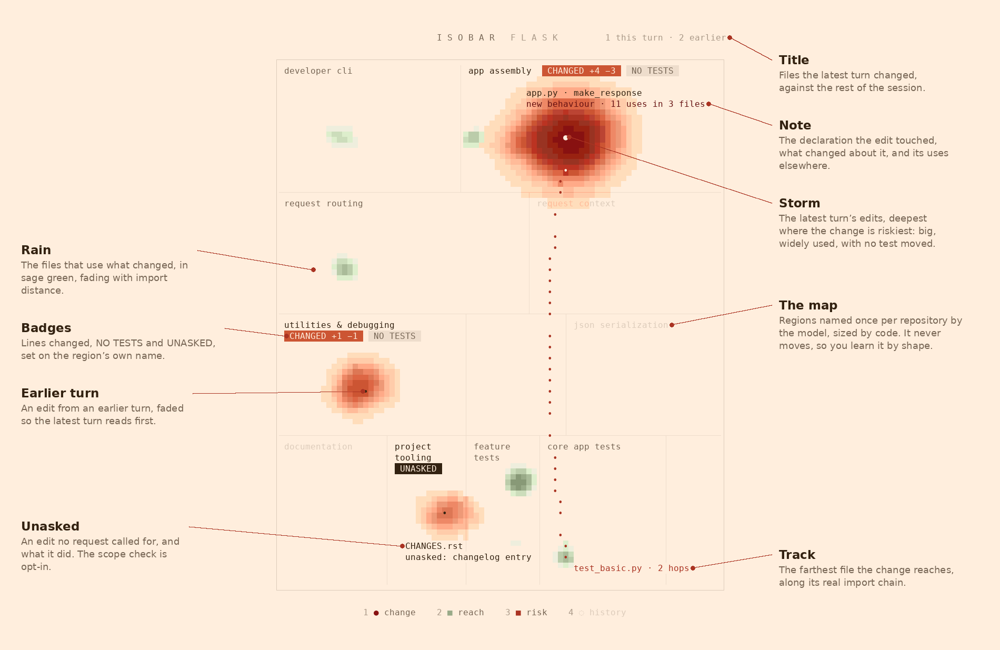
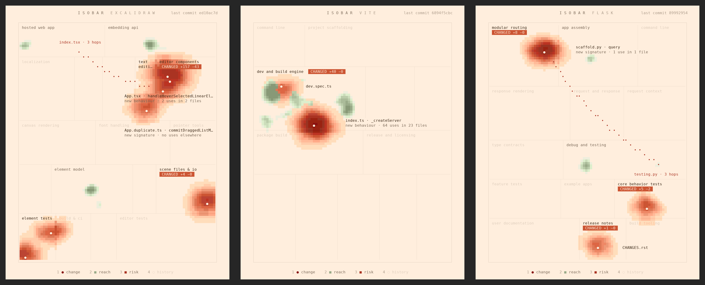
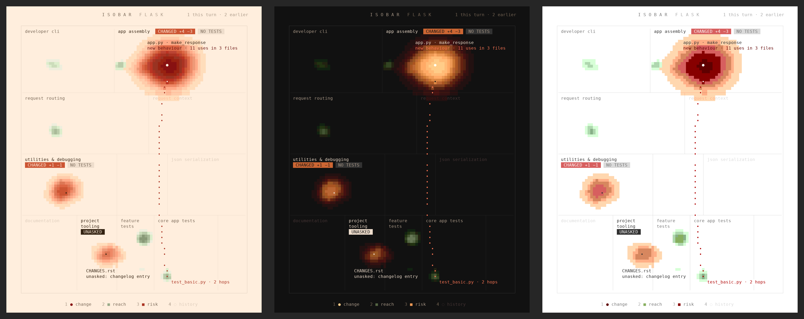

# isobar


[](https://github.com/r3al1tym/isobar/actions/workflows/ci.yml)

> **A weather map for every change your agent makes. Ask for something big, then see at a glance where it landed across your product, what it did there, and what else it reaches, on a map of your repo that never moves.**

isobar is a [Claude Code](https://claude.com/claude-code) mod that docks a pane beside the conversation and draws the session's change as weather over a fixed map of your repository. You read it as you read a weather radar: a red storm where Claude edited, green rain over the code that uses what changed. Ask for something high-level and the pane shows which parts of the product the work touched, captions what it did in each, and rains on the code that uses it. You understand a complex change before you read its diff, and a part you did not expect it to reach stands out at once. Across 300 recent commits in six public repositories, the median commit rains on 0 to 12 files, against 59 to 352 when every importer is marked, and still reaches 87 to 98 percent of the files a language server says use the change.


## What it shows

- **Where the change landed.** A storm on each file Claude edited, in its region of the map. You see at a glance whether the work landed where you expected.
- **What it did there.** Once a turn ends, a small model reads the diff of each changed region and captions it under the region's name in a few words, such as `warns on slow requests` or `covers slow warnings`. The caption is the diff's own account, written without your requests, so you can set it against what you meant.
- **What it reaches.** Green rain on the files that use what changed, as light rain shows on a radar, apart from the change's red storm. isobar reads each edit declaration by declaration: a new signature or a new behaviour rains on the files that name it, and an edit to comments or imports stays dry. The note beside the edit says how far it reaches, as in `new behaviour · 11 uses in 3 files`.
- **This turn against the session.** The latest turn's edits burn brightest and earlier turns fade, so a long session still reads in one look.
- **What you never asked for.** Turn on the scope check and, after each turn, a small model compares your requests with the turn's diff. An edit nobody asked for carries `UNASKED` and a few words on what it did.
- **The same frame every time.** Each repository is cut into named regions once and kept. Every change lands on the same map, so after a few sessions you read a change by its shape, the way you read a weather chart of your own country.

## Install

```bash
claude plugin marketplace add r3al1tym/isobar
claude plugin install isobar@isobar
```

The pane opens by itself on the first edit of a session, once the terminal is 144 columns or wider. At any width, `/isobar` opens it and closes it again. To turn on the scope check, run `/plugin configure isobar@isobar` and set `scope` to `on`.

From a clone, link the folder into your skills directory, where Claude Code loads it in every session as `isobar@skills-dir` and reloads it when you save a file:

```bash
git clone https://github.com/r3al1tym/isobar ~/src/isobar
ln -s ~/src/isobar ~/.claude/skills/isobar
```

For one session only: `claude --plugin-dir ~/src/isobar`.

## Reading the map



- **Storm.** Each edited file is an eye in its region. The storm is deepest where the change is riskiest: a big edit to widely used code with no test moved beside it. Only the latest turn's riskiest edit reaches the deepest reds; an earlier turn's edits fade to a light shower with a small eye.
- **Caption.** Under a changed region's name, what the change does there, from the gist.
- **Badges.** The region's name carries `CHANGED +a −d`, `NO TESTS` when source code changed what it does and no test moved with it (a changed test counts when it imports the file, shares its name, or its new lines name what the edit touched or introduced, such as a new config key), `UNASKED` when the scope check flagged an edit, and `EXPECTED` on a region history says should have changed.
- **Note.** The edited file and the declaration it touched, then how it reaches: `new signature` or `new behaviour` with its uses, `comments only`, or, for a file isobar reads whole, how many files depend on it.
- **Rain.** The files that use what changed, in sage green, fading with import distance.
- **Track.** The farthest file the change reaches, along its real import chain, labelled `file · N hops`. A file is named by as much of its path as tells it apart from the others on the pane: `sansio/app.py` beside `flask/app.py`.
- **Title.** The repository, and how many files the latest turn changed against the rest of the session.

A region the weather reached is named in ink; a dry region's name is a faint inscription. With nothing uncommitted, the pane shows the last commit and its hash.

## Use

- `/isobar` toggles the pane and gives it the keyboard; `/isobar map` redraws the basemap.
- With the pane focused, `1` to `4` toggle the layers (change, reach, risk, history), `p` asks Claude to check the farthest reach (it reads the chain and runs that file's tests), and `m` redraws the map. Esc hands the keys back.
- History's dashed rings start switched off: press `4` to show the files that usually change with these and did not this time.
- An Edit or Write in another repository switches the pane to that repository's map; a Bash command keeps the map it has.
- The desktop app, VS Code and mobile get the same forecast as text.

Every repository gets its own map:



## Settings

Set these with `/plugin configure isobar@isobar` in Claude Code, or from a shell with `echo '{"scope":"on"}' | claude plugin configure isobar@isobar --values-stdin`. A change applies when Claude Code restarts; a clone linked into the skills directory is `isobar@skills-dir`.

| Setting | Values | What it does |
| --- | --- | --- |
| `gist` | `on` (default), `off` | Once a turn that changes files ends, and when the pane shows a commit, ask `smallModel` to caption what the change does in each region. |
| `scope` | `off` (default), `on` | After each turn that changes files, ask `smallModel` which changes your requests never called for. |
| `smallModel` | `sonnet` (default), any model alias or id | The model the gist and the scope check ask. |
| `mapModel` | empty (default), any model alias or id | The model that names the basemap's regions, once per repository; empty uses the model the session runs on. |
| `ground` | `paper` (default), `night`, `auto` | Warm paper, the terminal's near-black, or whichever matches your Claude Code theme. |
| `colors` | `auto` (default), `truecolor`, `256` | How many colours the terminal paints. `auto` reads it from the environment Claude Code started in. |
| `panel` | `auto` (default), `command` | Open the pane on the session's first edit, or only on `/isobar`. |



The warm paper needs 24-bit colour. Claude Code paints 24-bit where `COLORTERM=truecolor` is set (and in kitty, Ghostty and iTerm) and never inside tmux; everywhere else it paints xterm's 256 colours, where the cream would turn yellow, so isobar switches to white paper and xterm's own colours there. Windows Terminal draws 24-bit but never sets `COLORTERM`; add `export COLORTERM=truecolor` to your shell profile to get the paper.

To give a team one shared map, commit it as `.isobar/map.json`; from a clone of isobar, `pnpm preview --repo <your-repo> --build model --map <your-repo>/.isobar/map.json` draws one.

## How it works

1. **Facts from git.** On each refresh isobar runs read-only git calls in parallel: the current commit, the line count of every tracked text file, every import line in JavaScript, TypeScript and Python, the last 400 non-merge commits, and the `tsconfig`, `jsconfig`, `package.json` and `pnpm-workspace.yaml` files that say where imports point. Commits that touch more than 40 files are dropped as bulk moves.
2. **The import graph.** Import lines resolve to repository files: relative specifiers with extension and `index` probing, `tsconfig` paths and `baseUrl`, workspace packages by name, `package.json` `#imports`, and Python 3's absolute and relative modules, multi-line imports included. Imports of outside packages are left out.
3. **The change, declaration by declaration.** The uncommitted diff (`git diff -U0`) and each changed file before and after are read into declarations: functions, classes, methods, fields, types and constants. A declaration whose header changed has a new signature; one whose code changed otherwise has a new behaviour; one whose code is the same changed only comments. Untracked files this session wrote count too. With nothing uncommitted, the last commit.
4. **Its users.** One `git grep -w` finds the files that depend on a changed file, at any import distance, and name a touched declaration or a function in the same file that calls one. Those are the rain. A file isobar cannot read by declaration (another language, a new or deleted file, module-level code, a file over 20,000 lines, or any past the first 40 changed files) rains on every importer, three hops out.
5. **The session.** Each refresh hashes the changed files (`git hash-object`, which stores nothing), so isobar knows which turn last changed each one.
6. **The gist.** When a turn ends, one call to `smallModel` carries each changed region's name and blurb, its files with their line counts and touched declarations, and their diff, capped at 400 lines shared across the files. It asks for a caption of 2 to 4 words per region. Your requests stay out of it. A caption holds until its region's change changes; while a turn runs, the last caption stays.
7. **The scope check** (opt-in). When a turn ends, one call to `smallModel` carries your last four requests and the turn's diff, capped at 400 lines, and asks which changes no request called for. A flag holds until the file changes again.
8. **The map.** Once per repository, isobar cuts the tree into about 160 units (big source folders opened to their files, the rest taken a folder at a time) and asks the session's model to group them into at most 20 regions in 3 to 6 bands, from where work enters down to the foundations. Every file lands in exactly one region; when the model's answer is unusable, the folders themselves become the regions. A region's area is its lines of code times how much of the rest depends on it. The map is kept in Claude Code's plugin store, and new files join the region their imports point to, so the frame never grows or moves.
9. **The picture.** The storm and the rain are density fields over the map's layout, binned into 17 colour steps that move evenly in a perceptual colour space: the storm in reds, the rain in sage greens wherever it outweighs a storm, as a radar colours storm and rain. They are drawn in half-block cells as one Raster.

Refreshes run 500 ms after Claude's last tool call, one at a time.

## Performance

One refresh at each repository's latest commit, median of 5 after a warm-up, on a laptop (Intel Core Ultra 7 265H, WSL2):

| Repository | Text files | One refresh |
| --- | --: | --: |
| express | 211 | 33 ms |
| flask | 230 | 67 ms |
| excalidraw | 1,018 | 298 ms |
| vite | 2,736 | 107 ms |
| django | 5,675 | 437 ms |
| VS Code | 19,547 | 1.8 s |

- **Most of a refresh is git.** Reading the change by declaration took a median of 29 to 276 ms over 60 recent commits per repository (1.3 s at VS Code's 95th percentile), and the weather and the drawing together under 25 ms everywhere but VS Code (300 ms).
- **Nothing waits on it.** Refreshes run in the background, one at a time, and the conversation goes on while they do.
- **The basemap** is one model call per repository: 36 s for Django and 48 s for Vite on Opus. While it runs, the pane says it is drawing the map.
- **The gist and the scope check** are one small call each after a turn ends, run side by side, a few seconds on Sonnet, and never hold up a refresh.

## Accuracy

Each number below is measured against an outside ground truth on the same six repositories; [bench/](bench/README.md) reproduces it and [bench/results.md](bench/results.md) breaks it down.

- **The import graph** matches the TypeScript compiler and grimp: recall 0.998 to 1.0 on all six, precision 0.92 to 1.0. Most of isobar's extra edges are real dependencies the reference leaves out: `from pkg import submodule` also runs `pkg/__init__.py`, and the compiler cannot resolve a workspace package without installed `node_modules`.
- **The rain.** Over 300 recent commits (60 per repository, 30 for VS Code and Django), the files isobar rains on were checked against TypeScript's `findReferences` and jedi. The rain covers 87 to 98 percent of the files that reference a changed declaration, or a function in the same file that calls a changed private one. Of the files it rains on, 47 to 86 percent are such files, and 25 percent on VS Code, where a common member name such as `setActive` matches declarations of the same name elsewhere.
- **Less rain.** The median commit rains on 0 files in express (97 when every importer is marked), 9 in Excalidraw (352), 1 in Vite (137), 12 in VS Code (66), 1 in Flask (67) and 3 in Django (59).
- **The frame holds.** Drawn three times from scratch, a map groups files much the same way on Flask and Excalidraw (adjusted Rand index 0.89 to 0.98, where 1 is the same grouping) and less so on Vite (0.54 to 0.87), which is why isobar draws it once and keeps it. A map drawn a year ago, kept through a year of commits, still agrees with a fresh one at 0.92 to 0.97 on Flask and Excalidraw and 0.53 to 0.90 on Vite; the year's 2 to 532 new files moved no region, and resizing the pane keeps every region in place.
- **History is weak evidence.** Backtested over 300 commits per repository, a ring was right 38 to 79 percent of the time and named 4 to 16 percent of the files that did change. That is why rings start switched off.
- **The gist and the scope check** have no benchmark yet. Each is a model's judgement; see Limitations.

## Limitations

- **Languages.** Declarations and the import graph are read for JavaScript, TypeScript (with Vue and Svelte files) and Python. Other languages show their edits, history and map, but no rain.
- **Static names only.** A use is a file that imports the changed file, at any distance, and names the declaration. A method called through an object built elsewhere, dependency injection, dynamic imports built from strings, and a default export imported under another name are invisible to it, or read file-wide.
- **The scope check is a judgement.** It reads your requests and the diff, never your intent. Take `UNASKED` as a prompt to look, and its absence as no proof of anything.
- **A caption is a summary.** It reads up to 400 diff lines; on a change past that, the files late in the diff are captioned from their names and line counts alone.
- **History is a forecast.** A ring says these files usually change together; it is a prompt to check, never a finding.
- **Early access.** Function hooks are an early-access Claude Code surface that may change between releases. This version is checked against Claude Code 2.1.287 with `claude plugin validate .` and `claude plugin test .`.

## Privacy

isobar reads git and draws a pane; it writes nothing to your repository and makes no network calls of its own. Its model calls go through Claude Code's own model access. The basemap call, once per repository, carries file and folder paths, their sizes and up to four imported file names per file, never file contents. The gist, on by default, carries up to 400 lines of the change's diff and never your requests. The scope check, off by default, carries your recent requests and up to 400 lines of the turn's diff. [SECURITY.md](SECURITY.md) has the details and the threat model.

## Contributing

See [CONTRIBUTING.md](CONTRIBUTING.md) for the development loop, the preview tool and the rules the picture keeps. [bench/](bench/README.md) reproduces every number above on public repositories. [docs/design.md](docs/design.md) tells how the design came about. The project follows a [Code of Conduct](CODE_OF_CONDUCT.md).

## License

[MIT](LICENSE) © r3al1tym.
