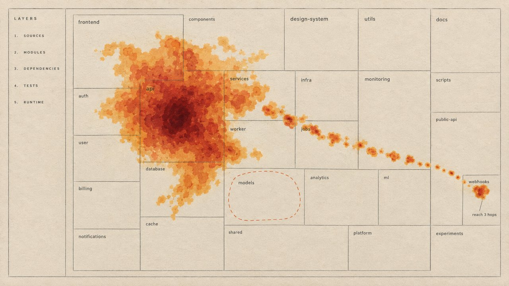
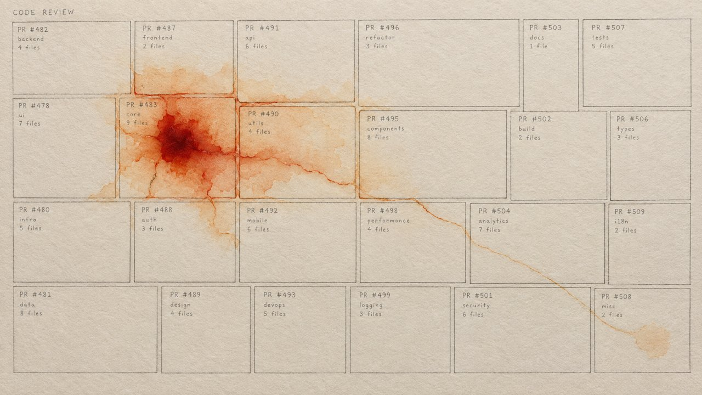
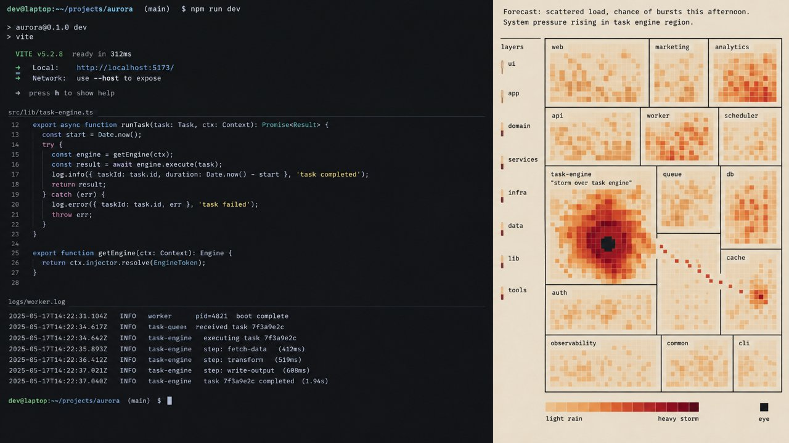
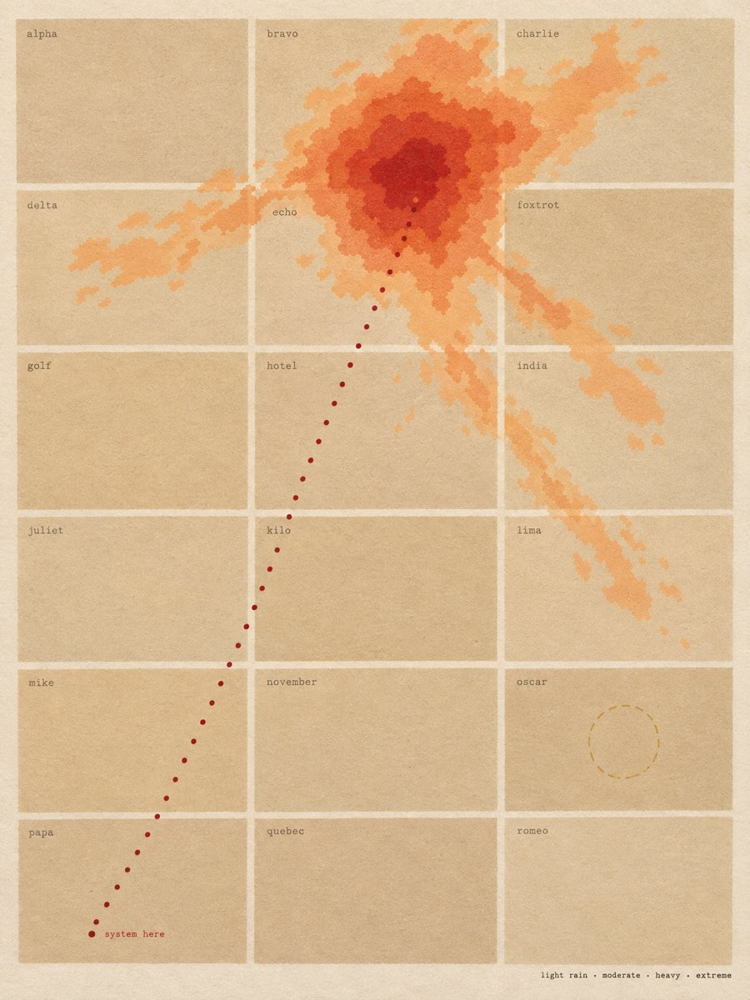
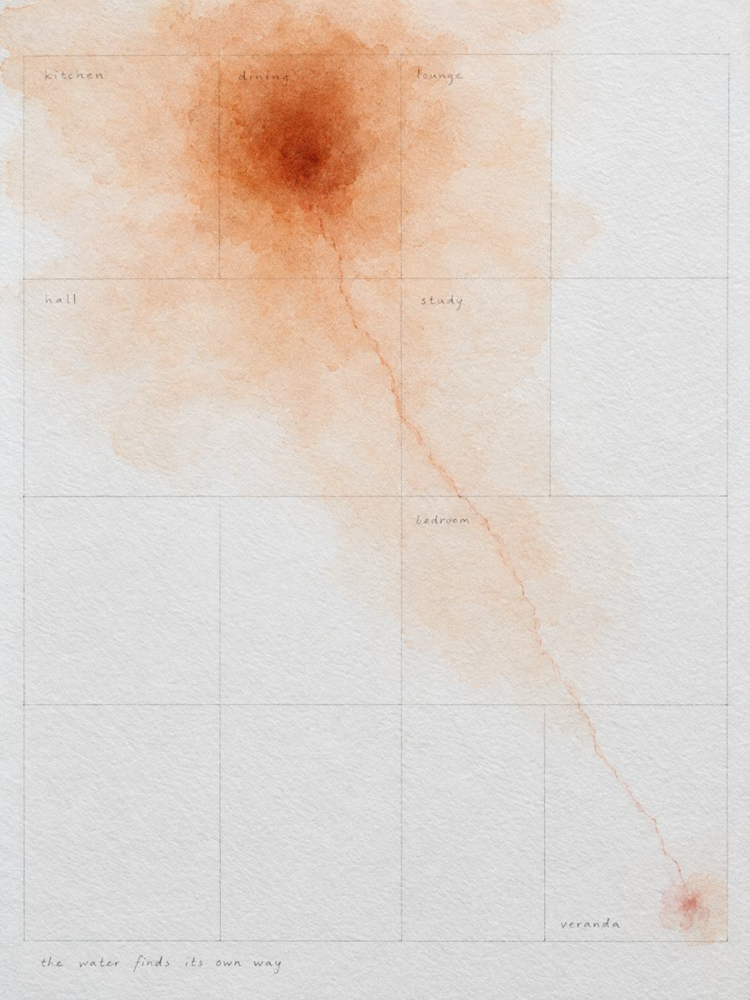
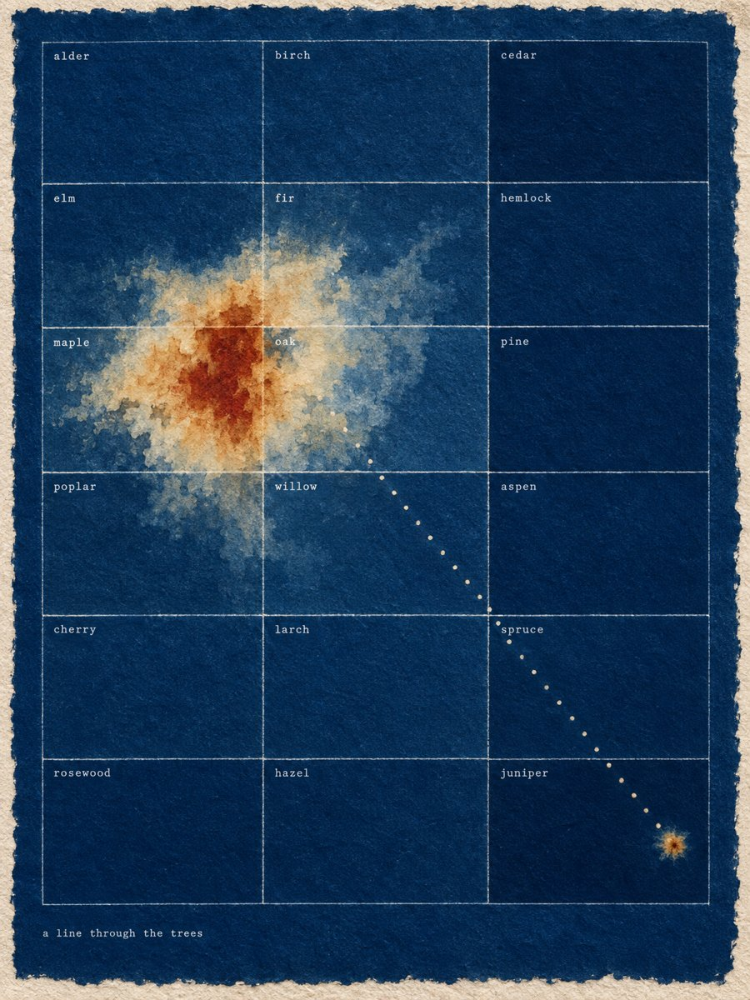

# Design notes

isobar treats a session's change as weather over a map that never moves. A red storm sits where Claude edited, and green rain falls on the code that uses what changed, as on a weather radar. The latest turn shows brightest, each changed region carries a caption of what the change did there, and a badge marks an edit nobody asked for. The map is the same every time you look, so after a few changes you read it by shape, the way you read a weather chart of your own country.

## Who it is for

An engineer in a Claude Code session, mid-change, after Claude has edited a handful of files. Before they commit or review they carry three questions: what did it do across the product, did it do what I asked, and what else does it touch? The pane answers at a glance and points at the one file worth opening next.

## The layers (keys 1 to 4)

Each layer is a fact, an estimate or a forecast, and the picture keeps them apart.

- **Change** (fact). The edited files, each an eye in its region. The latest turn's edits burn brightest; an earlier turn's fade to a light shower with a small eye, so the frame shows this turn against the session.
- **Reach** (fact). The files that use what changed: they depend on the changed file and name a declaration the edit touched, or, for a private one, a function in the same file that calls it. A new signature and a new behaviour both rain; an edit to comments or imports stays dry. Rain fades with import distance, and the dotted track follows the real import chain to the farthest file. A file isobar cannot read by declaration rains on every importer, three hops out.
- **Risk** (estimate). The storm proper: how big the edit is, how much of the repository uses it, and whether a test moved with it.
- **History** (forecast, off until `4`). A file outside this change that changed in at least 60 percent of the past commits touching one of these files, at four or more times its usual rate. It is drawn as dashed rings only, never filled, because nothing happened there yet. Backtested, 38 to 79 percent of rings named a file the commit really changed, so they start switched off.

## The judgements

Two small-model calls after a turn, each drawn as words, never as weather.

- **Caption** (on by default). Once a turn ends, a small model reads each changed region's diff, never your requests, and captions what the change does there in 2 to 4 words, so you can set the diff's own account against what you meant.
- **Scope** (opt-in). After a turn, a small model compares your requests with the uncommitted diff of each file the turn changed, and an edit nobody asked for carries `UNASKED` on its region and a short note.

## The basemap

- At most 20 regions in 3 to 6 bands, ordered from where work enters the system down to its foundations, with tests, tooling and docs last.
- A region's area is its static weight in the codebase (its size and how much outside it imports it, on a scale of 1 to 10), never this change's churn, so the map does not breathe with every edit.
- Regions that import each other sit together, so distance on the map means something.
- It is drawn once per repository and kept. New files join the region their imports point to, and `/isobar map` redraws it on purpose. A team can commit `.isobar/map.json` to share one map.

## Why a printed chart

The terminal is treated as a print medium: a cartographic sheet set in half-block cells. The weather ramps step evenly in a perceptual colour space, so no band jumps against its neighbour. The change and its reach take a radar's two hues, red and green, the green grounded to a sage that sits with the sepia inks, so the two read apart without a legend. Words are kept to what the map cannot say by itself, and each one sits on what it describes. The chart is printed on warm paper by default; in 256-colour terminals it moves to white paper with xterm's own colours, since the cream has no 256-colour equivalent.

## Where it came from

The look began as loose concept frames, rendered before any code to find an idea outside the usual dashboard look, then read for the idea and rebuilt with real data. The first round found the weather plate over a survey plat; the second pushed the weather to the edges of the sheet; the current pane brought back a frame, a title and a one-line legend.

| First round | | |
| --- | --- | --- |
|  |  |  |
| **Second round** | | |
|  |  |  |
